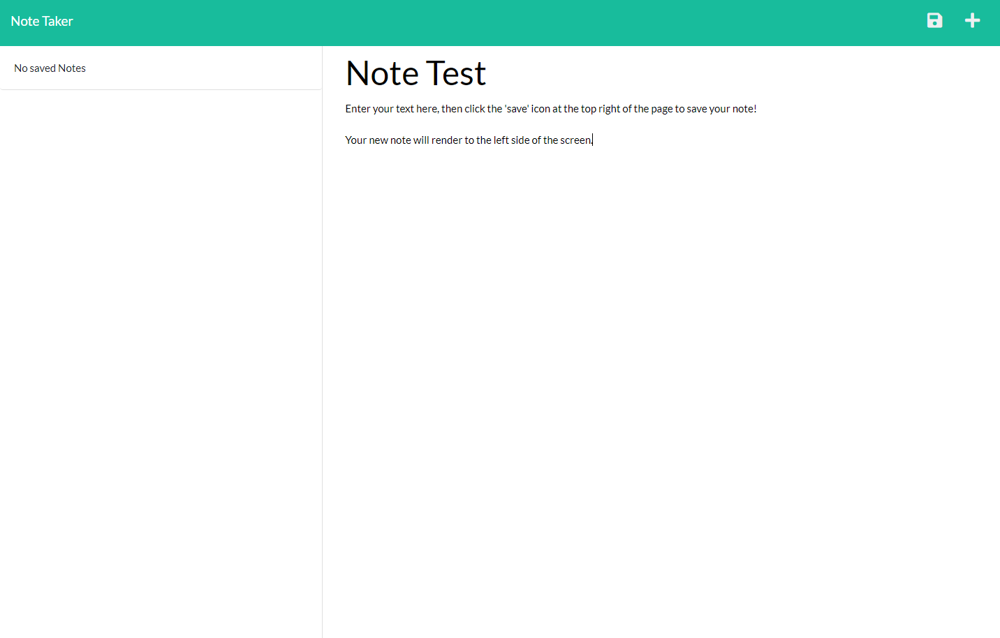
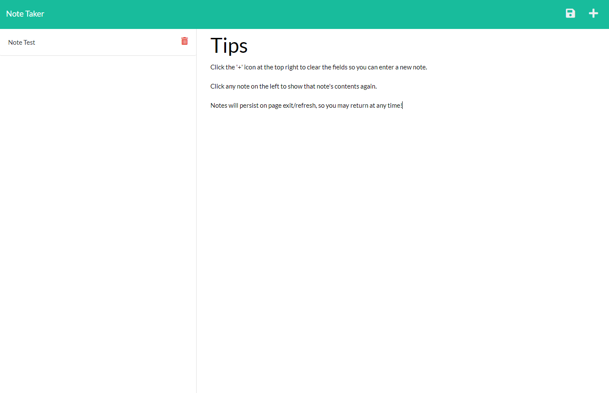

# note-taker-bcs

## Description

This is a simple, web-based note-taking app that uses Javascript and Express to recieve and save text notes. All of the notes you create are stored into a JSON file which is dynamically appended to as you create and delete notes; but all these fancy words point towards one simple objective, and that's attaining a clean, easy-to-use interface for managing notes. Use this app like a virtual notepad to create a list of things you'd like to remember, as all the notes you create are neatly arranged on the left side of the interface. Creating this app has taught me a lot about basic server functionality and how to attain data persistence in the absense of a dedicated database, so I hope you enjoy using it as much as I've enjoyed creating it.

## Table of Contents

- [Installation](#installation)
- [Usage](#usage)
- [License](#license)

## Installation

No installation is required if using the app at its deployed link:
[https://shrouded-scrubland-38516.herokuapp.com/]

If downloading the app directly from GitHub, the module 'express' must be downloaded before the app can function. Run 'npm install express' in the terminal upon download, and then type 'node server.js' to open the server. The site will then be live at local port 3001; simply navigate to [https://localhost:3001] to access it.

## Usage

On the home page, click 'Get Started' to initialize the app.

There is a text field on the right side of the screen where you may enter your note title and note content. Be sure to fill out both fields! Once you have, click the 'save' icon that renders at the top right of the page in order to save your note. It will render to the left side of the page, and any time you click it, its contents will reappear on the right.

Click on the '+' icon at the top right in order to clear the fields for a new note.

Lastly, you may delete any saved notes by clicking the red trash can icon.

## License

MIT License

Copyright (c) [2022] [shnala]

Permission is hereby granted, free of charge, to any person obtaining a copy
of this software and associated documentation files (the "Software"), to deal
in the Software without restriction, including without limitation the rights
to use, copy, modify, merge, publish, distribute, sublicense, and/or sell
copies of the Software, and to permit persons to whom the Software is
furnished to do so, subject to the following conditions:

The above copyright notice and this permission notice shall be included in all
copies or substantial portions of the Software.

THE SOFTWARE IS PROVIDED "AS IS", WITHOUT WARRANTY OF ANY KIND, EXPRESS OR
IMPLIED, INCLUDING BUT NOT LIMITED TO THE WARRANTIES OF MERCHANTABILITY,
FITNESS FOR A PARTICULAR PURPOSE AND NONINFRINGEMENT. IN NO EVENT SHALL THE
AUTHORS OR COPYRIGHT HOLDERS BE LIABLE FOR ANY CLAIM, DAMAGES OR OTHER
LIABILITY, WHETHER IN AN ACTION OF CONTRACT, TORT OR OTHERWISE, ARISING FROM,
OUT OF OR IN CONNECTION WITH THE SOFTWARE OR THE USE OR OTHER DEALINGS IN THE
SOFTWARE.